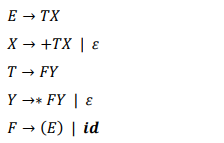
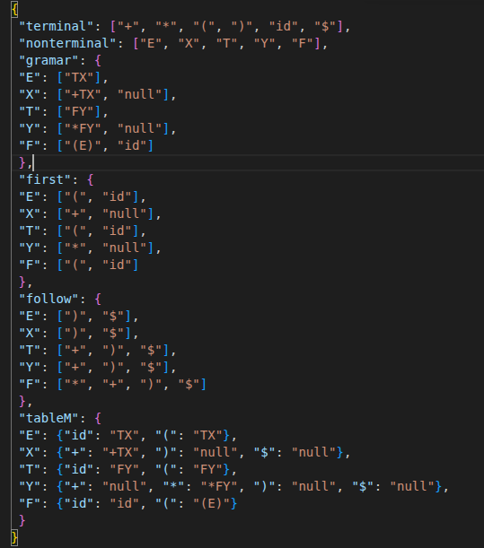

# 🔎 Analise_sintatica 
Repositório para o desenvolvimento da avaliação 2, referente a disciplina de Compiladores

Implementação da análise descendente

Nesse projeto você irá implementar um programa de Análise Sintática Descendente. O
analisador a ser construído deve possuir um buffer de entrada, uma pilha contendo a
sequência de símbolos da gramática, uma tabela de análise e um fluxo de saída

> 💬 Linguagem escolhida: `Java`


## 🚶 Passos a serem realizadas:
- [❌] - Fazer a classe tal;


> ✔️ - Feito

> 🔘 - Em andamento

> ❌ - Não iniciado


## 📦 Disposição do programa
     .
     ├── analise_sintatica
     │   └── src
     │       ├── main
     │       │    └── java
     │       │         └── com.faria
     │       │              ├── Main.java
     │       │              ├── LeitorTxt.java
     │       │              ├── EscritaTxt.java
     │       │              ├── Token.java
     │       │              │
     │       │              └── enums
     │       │                   ├── Tipagem.java
     │       │                   └── Constantes.java
     │       │
     │       └── test.java.br.com.faria
     │           ├── TestLeitorTxt.java
     │           └── TestTokenss.java
     │
     ├── target
     ├── untracked
     ├── README.md
     ├── pom.xml
     └── analisador_lexico.jar
     .

## 👷 Desenvolvimento


A gramática empregada para a análise sintática descendente é apresentada a seguir.:

<div align="center">
     
</div>


O dicionário "/untracked/dicionario_linguagem.json" contém: os valores terminais e não terminais; a gramática; os elementos first e follow; e a tabela M da GLC. 
###### Esse dicionário obrigatoriamente deverá ser usado em seu código. 

<div align="center">
     
</div>

O objetivo será ler como entrada um arquivo de texto de instruções dispostos linha
a linha. O programa deverá realizar a análise sintática descendente de todos os comandos.
Deverá ser gerado um arquivo de texto de saída. Esse arquivo deverá conter: cada
comando; se esse comando é válido; e execução da pilha passo a passo.
#### Exemplo de entrada: 
```
id*id
id*id+(id+id)
(id+id)*(id+id)
```

#### Exemplo de um arquivo de saída:
```
Input: id+id*id
Status: true
Stack: [
 [E], [X,T], [X,Y,F], [X,Y,id], [X,Y],
 [X,null], [X], [X, T, +], [X, T], [X, Y, F],
 [X, Y, id], [X, Y], [X, Y, F, *], [X, Y, F],
 [X, Y, id], [X, Y], [X, null], [X], [null], []
] 
```

1.  ### 📚 Principais Classes
Descreve o funcionamento das principais classes do projeto.


Criador de diagramas: https://app.diagrams.net/?splash=0#G1MNDvqLwhnGeQRzdopsxT-lrRcbgqdqLt#%7B%22pageId%22%3A%22JrWfula45WOMTxcmjdZU%22%7D

2. ###  ♻️ Fluxo de execução da classe Main.java
Pix Script

## 🔧 Como executar?
📁 A pasta "untracked" contém os arquivos que estão empregados no projeto em vários níveis, desde a implmentação do código quando das imagens do README.


Pontos importantes a descrever:
- Como executar o código: 
- Cuidados a serem tomados;

## ✒️ Autores: 
| [<br><sub>Gabriel Alexandre</sub>](https://https://github.com/aieFaria) |  [<br><sub>Henzo Henrique</sub>](https://github.com/HenzoHS) |  [<br><sub>Railson Bernardo</sub>](https://github.com/Railson-Bernardo) |
| :---: | :---: | :---: |


